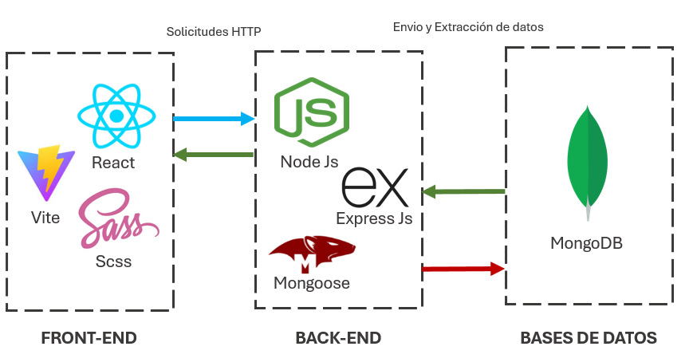
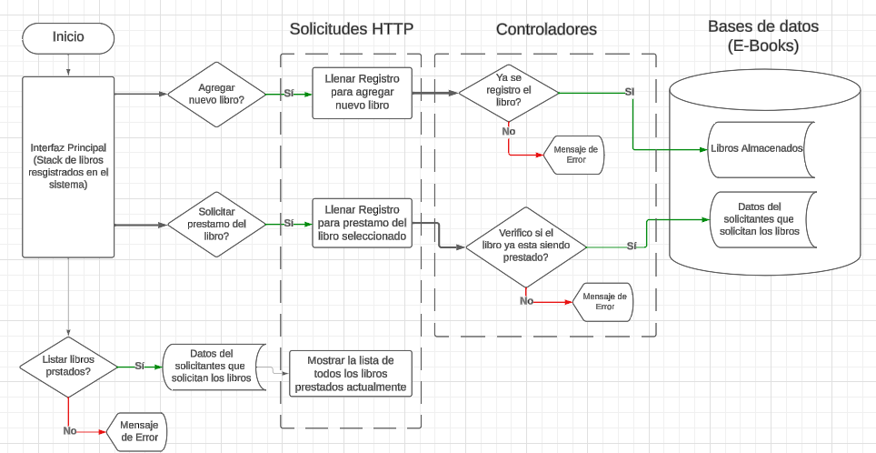

<p align='justify'>
<h1 style="display: inline-block;">E-Books</h1>
E-Books es un sistema de gestión para bibliotecas que realiza una búsqueda más rápida de libros específicos por el usuario, además de permitir agregar nuevos libros al sistema, así como realizar un seguimiento de los libros prestados actualmente.
</p>

- Proyecto: [DEMO](https://www.youtube.com/watch?v=vVouKXwfD8w&t=14s)
- URL: [WebSite](http://localhost:3006)


## Tecnologías:

Asegúrate de tener las siguientes tecnologías y dependencias antes de ejecutar el proyecto:

- 
- 
- 
- 
- 
-  

<div align="center">
  
</div>


## Futuras actualizaciones:
Las mejoras para este proyecto son las siguientes:
- Modo responsive (para móviles y tabletas).
- Agregar y solicitar más de 1 libro a la vez.
- Actualizar y eliminar un libro.
- Despliegue dinámico.


## Instalación:
### Getting Started

> Para implementar su aplicación localmente, debe seguir los pasos a continuación.
>
> > Clonar el repositorio

```sh
 git clone https://github.com/juanRCoder/E-Books.git
```

> > Instalar el paquete de modules (npm)

```sh
 npm install
```

> > Visualizar la app

```sh
 npm  start
```


## Diagrama de flujo:
- Este es un pequeño diagrama del funcionamiento de todo el sistema, todo lo que se construyó y se ideó para realizar el sistema de gestión para biblioteca.

<div align="center">
  
</div>


## Author:
### Juan Ramirez
- Linkedin: [Juan Ramirez](https://www.linkedin.com/in/juan-ramirez-490b84271/)
- Instagram: [juanrcoder](https://www.instagram.com/juanrcoder/)


- Proyecto: [DEMO](https://www.youtube.com/watch?v=vVouKXwfD8w&t=14s)
- URL: [WebSite](http://localhost:3006)


## Licence:
- Este proyecto está bajo la Licencia MIT - ver el archivo [LICENSE](LICENSE) para más detalles.
- Duración del proyecto: 28 dias.